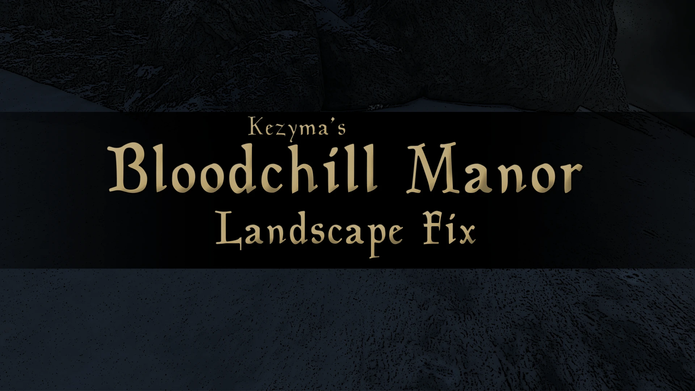

A landscape fix for the Creation Club's Bloodchill Manor. With some mods installed, the entrance to Bloodchill Manor can end up blocked off by the landscape — this patch tries to remedy that.

> **Note:** This is likely caused by a number of mods that edit the landscape around Bloodchill Manor — not just the one I found it with — so it may help in those cases too.

## How I Found It

I came across this when using Bloodchill Manor alongside Majestic Mountains, which left the entrance to Bloodchill Manor blocked off by the landscape.

## Usage

The fix is simple: I copied all the vanilla and Creation Club records for the area into a separate ESP. Load it after whatever conflicts with Bloodchill Manor and it should solve the problem.
