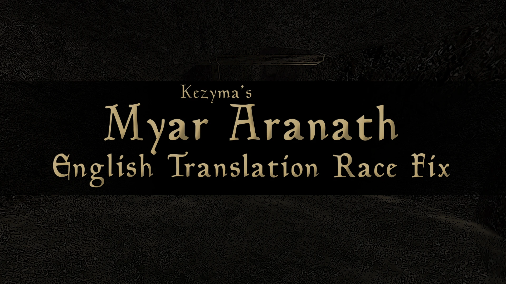

Anyone who's tried playing SureAI's total conversion mod Myar Aranath and also installed the English Translation mod will know that it causes the default Morrowind races to be offered to the player instead of the original three from the mod.

I've simply copied how the races are set up in the original mod and used Google Translate on the descriptions, so they should be in English.

> **Note:** I can't say for sure how accurate the translations are, or whether my naming for races (I took it from the wiki) is correct since I haven't actually played the mod yet, but the actual setup of the races matches the original.

- [Background](#background)
- [Installation](#installation)
- [Load Order](#load-order)
- [Troubleshooting](#troubleshooting)

## Background

For those who don't know what Myar Aranath is, it's the first game from SureAI in the same world as Arktwend, Nehrim and Enderal.

## Installation

<!-- TODO: replace (URL) with the SureAI Myar Aranath page and the ModDB English Translation page. -->

1. The mod installer can be found on their website: [Myar Aranath](https://sureai.net/games/myararanath/).
2. The English translation can be found on ModDB: [English Translation](https://www.moddb.com/mods/myar-aranath-rellict-of-kallidar/downloads/ma-english-translation).
3. You can then install this patch to fix the races.

## Load Order

I can't confirm if this is a correct load order, but I'm using the following and it seems to be working okay. I don't know if `ma_script_base.esm` is required.

```
MA_RoK_Eng v0001.esm
Additional_Journal_Translations_ENG.esp
Myar_Aranath_English_Race_Fix.esp
```

## Troubleshooting

> **Note:** To save anyone some time, if you get an error on starting a new game and you have Morrowind Code Patch installed, uncheck 'Script expression parser fix' from the Bug fixes section!
