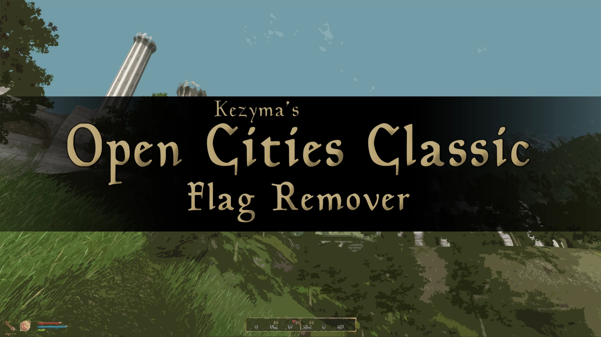

Open Cities Classic adds flags to each city in the game. I'm a bit of a purist in that regard and wasn't fond of them, so this patch simply removes them.

Someone had already made a patch for Open Cities Reborn, but nobody had done anything for Classic — so I went into the Construction Set and deleted the flags.
