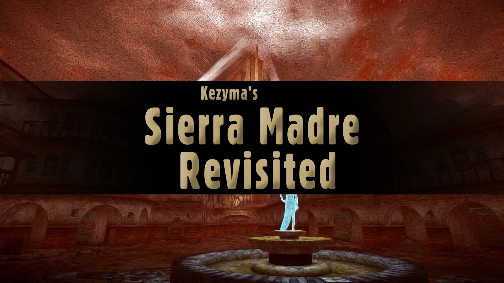

A very small mod that lets you return to the Sierra Madre after completing Dead Money.

It simply lets you back into the Sierra Madre world-space as you had left it, so you can explore the area in and around the casino, or enter the casino to do some gambling. It's probably as close to what the developers would have intended as possible, assuming they had intended to allow you back to the casino at all.

## Changes

There are only three edits in this plugin:

- Moves the normally hidden door to access the Sierra Madre to the back of the Abandoned BOS Bunker so that it can be accessed.
- Updates the script for exiting the Sierra Madre to return the player to the Abandoned BOS Bunker immediately, assuming they have already completed the DLC questline.
- Updates the script that allows you to kill ghost people so that it still functions after the end credits, to prevent them from being unkillable.

## Notes

There is at least one other mod that does something similar, although it makes different edits — some comments indicate these will cause issues if you haven't already completed the DLC.

This plugin doesn't re-enable any companions, it doesn't unlock the door back to the vault, and it doesn't give you any special perks that you might have missed when you played the DLC.
