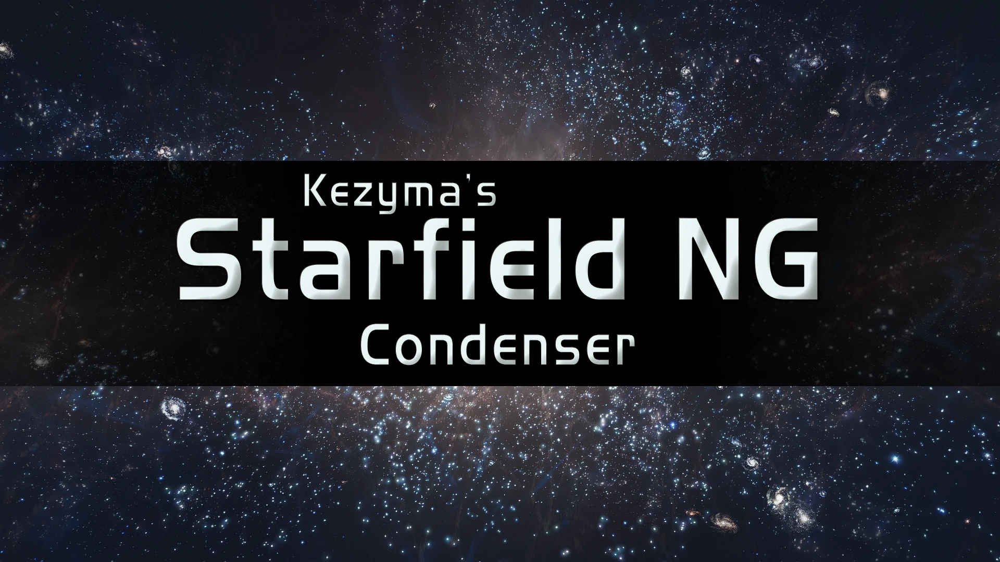

A small mod for those who find 10 runs of NG+ too much work.

## Features

- NG+1 will provide the final Starborn ship and outfit rewards that usually require NG+10.
- Any powers found in NG+1 will automatically be levelled up to rank 10, saving the need to reacquire them again.

## How It Works

The mod works by editing a few scripts and the forms for the spells that grant the powers. The following edits were made:

- On entering the Unity, the counter tracking this is incremented by 11 instead of 1, triggering the correct rewards when the new game starts.
- When the quest to visit the lodge is selected, the counter is decreased by 10, to the correct number. This allows the fixed lodge quest for NG+1 to happen, instead of going directly into random variants.
- When a power is acquired, if you're in NG+, it'll award the power 10 times to ensure it's at the maximum rank.
