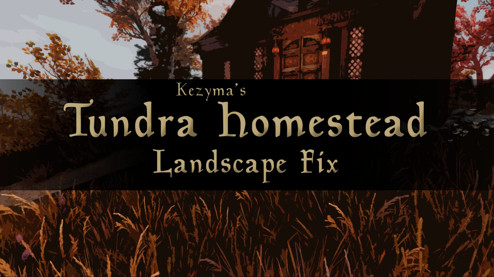

When combining Tundra Homestead from the Creation Club with other mods, this can cause issues with misaligned landscape around the house itself. This patch reapplies the landscape changes of Tundra Homestead to resolve those issues.

## How I Found It

After purchasing Tundra Homestead, I noticed some horrible clipping and missing ground just outside the entrance. Looking nearby, the only thing conflicting seemed to be the Dog House from Dogs of Skyrim. With no compatibility patch readily available, I opened both in SSEdit and merged the landscape changes, prioritising Tundra Homestead in an effort to get the land working again.

Needless to say, it has worked for me. I don't know if there will be any other issues, or if this patch will break anything (it shouldn't, and I haven't noticed any issues), so use at your own risk.

## Compatibility

This patch does not use the Dogs of Skyrim Compatibility Version, which moves the Dog House for compatibility with other mods. Unfortunately, it moves the Dog House practically on top of Tundra Homestead and causes even worse clipping, so if you're using the compatibility meshes they provide, you'll have to remove them or decide which mod you want to keep.
